# Bayesian statistics

## Bayesian models

In Bayesian statistics we combine prior information with data via a model for the data-generating process (using Bayes theorem) to get revised information in the form of a *posterior distribution*.

We assume that the data, $X$, arises from a process described by a distribution that depends on some parameters, $\theta$. We denote the model, $p(x|\theta)$, so that
$$ X \sim p(x|\theta). $$
When this model is considered a function of $\theta$ for given fixed $x$, it is often referred to as the *likelihood* function, and written $L(\theta;x) \equiv p(x|\theta)$. 

## Bayes theorem

The prior information about the parameters is described using a probability distribution $\pi(\theta)$, so the joint distribution of the parameters and the data can be written
$$\pi(\theta,x) = \pi(\theta)p(x|\theta) = \pi(\theta)L(\theta;x).$$
Note that $\pi()$ is used to denote different distributions - it is supposed to be clear from the arguments which distribution is being referred to.

Given observed data $X=x$, we use Bayes theorem to construct the posterior distribution as
$$ \pi(\theta|x) 
= \frac{\pi(\theta)L(\theta;x)}{\pi(x)} 
= \frac{\pi(\theta)L(\theta;x)}{\displaystyle\int_\Theta \pi(\theta')L(\theta';x)\,d\theta'} 
\propto \pi(\theta)L(\theta;x), $$
since the denominator is clearly just a normalising constant.

## Prior to posterior

So,
$$\pi(\theta|x) \propto \pi(\theta)L(\theta;x), $$
and *the posterior is proportional to the prior times the likelihood*. The posterior distribution $\pi(\theta|x)$ is a distribution describing our beliefs about the parameter (vector) $\theta$ taking into account the observed data $X=x$, as opposed to the prior distribution, $\pi(\theta)$, which is the distribution describing beliefs about the parameters prior to to observing the data.

Clearly the likelihood is responsible for transforming the prior to the posterior, so the likelihood function contains all information in the data relevant to inference about $\theta$.

## Simple example - slope failures

Suppose we are interested in the number of slope failures occurring on a particular line each year. An expert believes that the rate at which slope failures occur can be well described by a Gamma(2,1) distribution - this has a mean and variance of 2. Historical data reveals that there have been 32 failures in the last 20 years. How should the expert revise their belief in the light of this data?

Let the annual rate be $\theta$, so that $\theta \sim \text{Gamma}(2,1)$. The simplest model for the data is that the number of failures is Poisson with mean $20\theta$, that is $X\sim \text{Poisson}(20\theta)$.

---

We therefore have
$$\pi(\theta) \propto \theta e^{-\theta} \quad \text{and}\quad L(\theta;x) \propto \theta^{32}e^{-20\theta},$$
and so Bayes theorem gives
$$\pi(\theta|x) \propto \theta e^{-\theta} \times \theta^{32}e^{-20\theta} = \theta^{33}e^{-21\theta},$$
and so the posterior is Gamma(34,21), which has a mean of 1.62 and a variance of 0.077. Note how the mean has shifted towards the empirical estimate (of 1.6) and the uncertainty has been greatly reduced.

This problem has an analytical solution, since a Gamma prior is *conjugate* to a Poisson likelihood, leading to a Gamma posterior. But most interesting problems are not tractable, and we use computers to generate Monte Carlo samples from the posterior of interest.

---


```r
curve(dgamma(x,34,21), 0,5, col=2,lwd=2, 
  ylab="Density", main="Prior and posterior")
curve(dgamma(x,2,1), 0,5, col=3,lwd=2, add=TRUE)
abline(v=32/20, col=4,lwd=2)
```

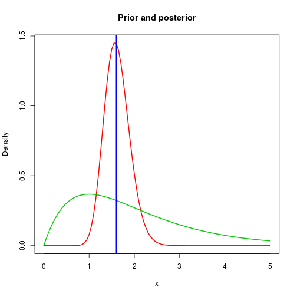

# Bayesian hierarchical models

## Introduction

A Bayesian hierarchical model can often be thought of as simply a graphical model where the nodes represent quantitative random variables rather than (just) discrete categorical outcomes. Some nodes represent unobserved variables, and others the data to be observed. The model defines the joint distribution of unobserved model parameters and the data, completely specifying the data generating process, and we are typically interested in the conditional distribution of the model parameters given the data. This is usually intractable, but we typically use Markov chain Monte Carlo (MCMC) methods to generate stochastic samples from this distribution.

## JAGS and rjags

[JAGS](http://mcmc-jags.sourceforge.net/) (Just Another Gibbs Sampler) is an example of some general-purpose free software for carrying out Markov chain Monte Carlo (MCMC) simulation for (intractable) Bayesian hierarchical models. Note that JAGS is a standalone piece of software - it is not an R package, and must be installed separately (outside of R) before being used, and may require admin privileges.

Once JAGS is correctly installed on your system, there is an R package on CRAN called `rjags` which is straightforward to install, and makes it easy to use JAGS from within R. It should be possible to install with

```r
install.packages("rjags")
```
but note that installation of this package will fail if JAGS is not already correctly installed. 

## Using rjags

Once JAGS and `rjags` are installed it can be loaded for use in the usual way.

```r
library(rjags)
```


```r
help(package="rjags")
?"rjags-package"
?jags.model
```
This package does not have any vignettes.

## Example: slope failures with rjags


We can reproduce our analytically tractable example using `rjags` as follows.

```r
x=32
data=list(x=x)
init=list(theta=1)
modelstring="
  model {
    x~dpois(20*theta)
    theta~dgamma(2,1)
  }
"
```
Note that we put the JAGS model in a string, which we now pass to JAGS for analysis.

---


```r
model=jags.model(textConnection(modelstring), 
  data=data, inits=init)
```

```
## Compiling model graph
##    Resolving undeclared variables
##    Allocating nodes
## Graph information:
##    Observed stochastic nodes: 1
##    Unobserved stochastic nodes: 1
##    Total graph size: 6
## 
## Initializing model
```
---


```r
update(model,n.iter=100)
output=coda.samples(model=model,
  variable.names=c("theta"), n.iter=2000, thin=1)
```
---


```r
print(summary(output))
```

```
## 
## Iterations = 101:2100
## Thinning interval = 1 
## Number of chains = 1 
## Sample size per chain = 2000 
## 
## 1. Empirical mean and standard deviation for each variable,
##    plus standard error of the mean:
## 
##           Mean             SD       Naive SE Time-series SE 
##       1.627008       0.282412       0.006315       0.005844 
## 
## 2. Quantiles for each variable:
## 
##  2.5%   25%   50%   75% 97.5% 
## 1.115 1.430 1.611 1.813 2.209
```

---


```r
plot(output)
```

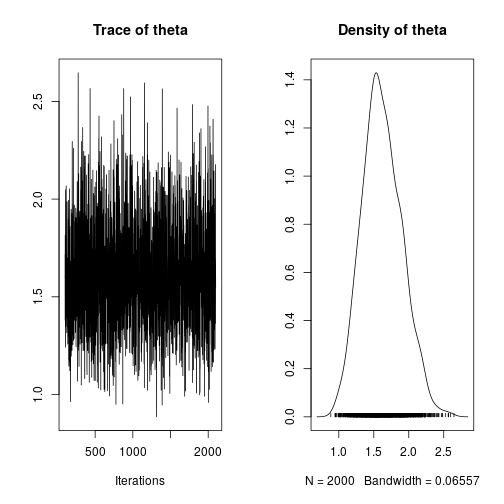

## Example - fitting distributions

Suppose we want to fit a parametric distribution (eg. Gamma) to some experimental data (eg. soil strength measurements).

Here we'll just simulate some synthetic data:

```r
set.seed(1)
n = 100
x = rgamma(n, 5, 0.5)
summary(x)
```

```
##    Min. 1st Qu.  Median    Mean 3rd Qu.    Max. 
##   2.539   7.158   9.608   9.860  12.324  20.578
```

---


```r
hist(x)
```

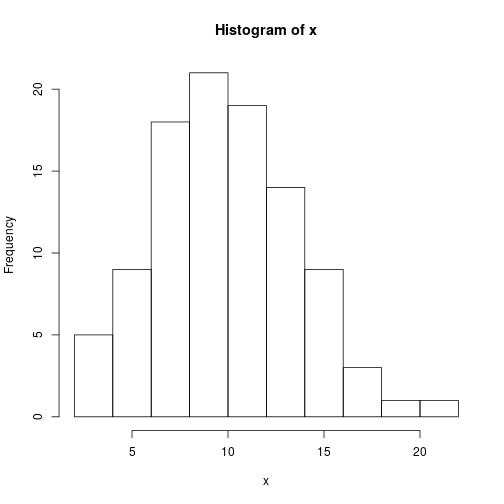

---

There are some standard frequentist techniques for fitting distributions to data.

```r
library(MASS)
fit = fitdistr(x, "gamma")
```

```
## Warning in densfun(x, parm[1], parm[2], ...): NaNs produced
```

```r
fit
```

```
##      shape         rate   
##   6.60335788   0.66973638 
##  (0.91122771) (0.09602435)
```

---


```r
hist(x,freq=FALSE)
curve(dgamma(x, fit$estimate[1], fit$estimate[2]),
  0, 30, add=TRUE, col=2, lwd=2)
```

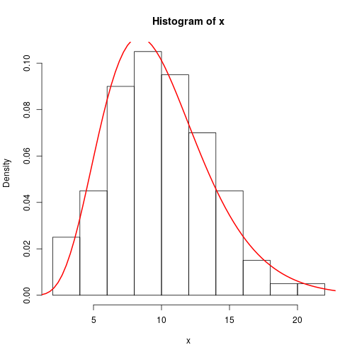

---

We can fit log-normal to the same data


```r
fitdistr(x, "log-normal")
```

```
##     meanlog       sdlog   
##   2.21082325   0.41257491 
##  (0.04125749) (0.02917345)
```

* Frequentist methods don't properly quantify and propagate uncertainty
* Let's do again using JAGS

---


```r
data=list(x=x, n=n)
init=list(a=1, b=1)
modelstring="
  model {
    for (i in 1:n) {
      x[i] ~ dgamma(a, b)
	}
    a ~ dgamma(1, 0.001)
    b ~ dgamma(1, 0.001)
  }
"
```

---


```r
model=jags.model(textConnection(modelstring), 
  data=data, inits=init)
```

```
## Compiling model graph
##    Resolving undeclared variables
##    Allocating nodes
## Graph information:
##    Observed stochastic nodes: 100
##    Unobserved stochastic nodes: 2
##    Total graph size: 105
## 
## Initializing model
```

---


```r
its=2500; thin=6
update(model, n.iter=2000)
output=coda.samples(model=model,
  variable.names=c("a","b"), n.iter=its*thin, thin=thin)
```

---


```r
print(summary(output))
```

```
## 
## Iterations = 3006:18000
## Thinning interval = 6 
## Number of chains = 1 
## Sample size per chain = 2500 
## 
## 1. Empirical mean and standard deviation for each variable,
##    plus standard error of the mean:
## 
##     Mean     SD Naive SE Time-series SE
## a 6.8379 0.9474 0.018949       0.043939
## b 0.6941 0.1001 0.002002       0.004788
## 
## 2. Quantiles for each variable:
## 
##     2.5%   25%    50%    75%  97.5%
## a 5.1162 6.165 6.7958 7.4341 8.8916
## b 0.5127 0.623 0.6888 0.7599 0.9018
```

---


```r
plot(output)
```

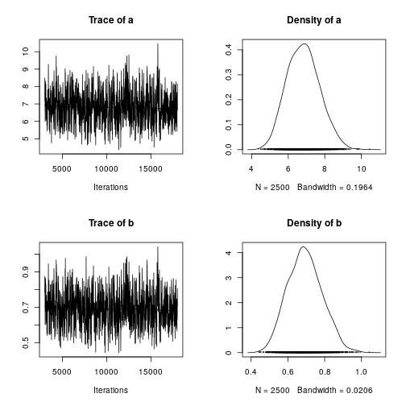

---


```r
## convert MCMC output to a matrix
mat = as.matrix(output)
dim(mat)
```

```
## [1] 2500    2
```

```r
## select 5 iterations at random
samples = sample(1:its, 5)
samples
```

```
## [1] 1038  528 1072  332 1149
```
---


```r
hist(x, freq=FALSE, ylim=c(0,0.15), main="Sample fits")
for (i in samples) curve(dgamma(x, mat[i,1],
  mat[i,2]), 0, 30, add=TRUE, col=2)
```

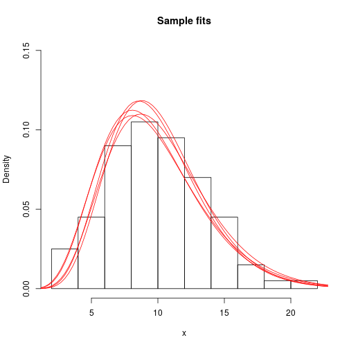

## Hierachical structure and latent variables

Minimal 2-layer DAG model structure

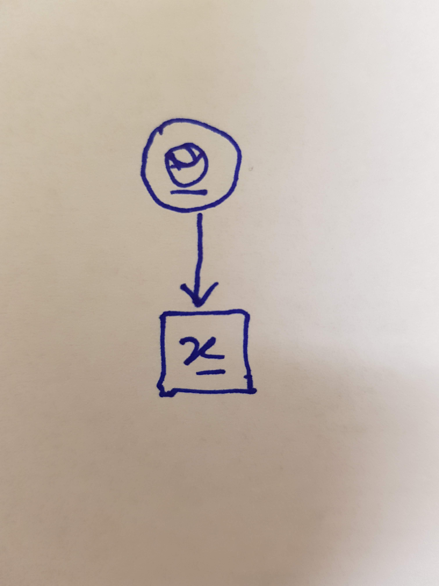{ height=40% }

(in Bayesian modelling, we often use rectangular nodes for data)

---

Typical 3-layer structure with latent variables, $z$

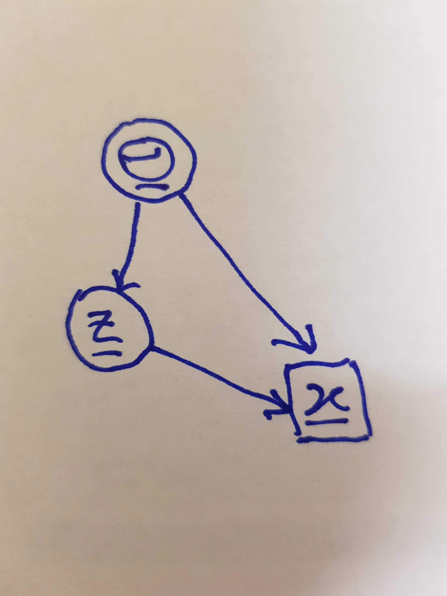{ height=50% }

$$\text{Factorisation:} \quad \pi(\theta,z,x) = \pi(\theta)\pi(z|\theta)p(x|z,\theta)$$

## Example - random effects


```r
library(lme4)
```

```
## Loading required package: Matrix
```

```
## Loading required package: methods
```

```r
library(lattice)
```


```r
?sleepstudy
example(sleepstudy)
```

---

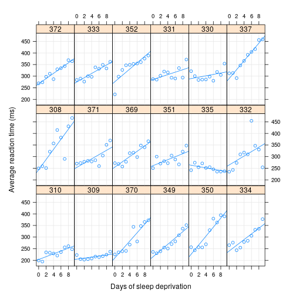

Reaction time with days of sleep deprivation in 18 subjects

---

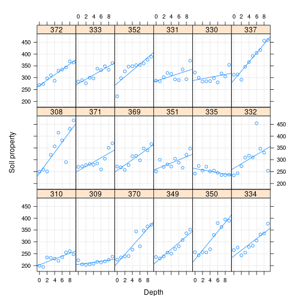

Soil property varying with depth in 18 London clay slopes

---

We want to treat the `Days` coefficient (the gradient of the regression line) as a *random effect*, which can vary from slope to slope, but drawn from a population of values from a distribution.

Here we will treat the intercept of each regression line as a *fixed effect* (but still a latent variable).


```r
data=list(y=sleepstudy$Reaction, x=sleepstudy$Days, 
  index=as.numeric(sleepstudy$Subject), 
  n=dim(sleepstudy)[1])
init=list(mu=1, tau=1, tau.s=1)
```

---


```r
modelstring="
  model {
    for (i in 1:18) {
	  slope[i] ~ dnorm(mu, tau.s)
	  inter[i] ~ dnorm(0, 0.0001)
	}
    for (j in 1:n) {
      y[j] ~ dnorm(inter[index[j]] + 
	    slope[index[j]]*x[j], tau)
	}
    tau ~ dgamma(1, 0.001)
    tau.s ~ dgamma(1, 0.001)
	mu ~ dnorm(0, 0.0001)
  }
"
```


---


```r
model=jags.model(textConnection(modelstring), 
  data=data, inits=init)
```

```
## Compiling model graph
##    Resolving undeclared variables
##    Allocating nodes
## Graph information:
##    Observed stochastic nodes: 180
##    Unobserved stochastic nodes: 39
##    Total graph size: 944
## 
## Initializing model
```

---


```r
its=2500; thin=8
update(model, n.iter=2000)
output=coda.samples(model=model,
  variable.names=c("mu","tau","tau.s"), 
  n.iter=its*thin, thin=thin)
```

---


```r
print(summary(output))
```

```
## 
## Iterations = 2008:22000
## Thinning interval = 8 
## Number of chains = 1 
## Sample size per chain = 2500 
## 
## 1. Empirical mean and standard deviation for each variable,
##    plus standard error of the mean:
## 
##            Mean        SD  Naive SE Time-series SE
## mu    11.375760 1.5151743 3.030e-02      3.210e-02
## tau    0.001515 0.0001851 3.702e-06      3.702e-06
## tau.s  0.037026 0.0174998 3.500e-04      3.955e-04
## 
## 2. Quantiles for each variable:
## 
##           2.5%       25%       50%       75%     97.5%
## mu    8.367399 10.416524 11.389598 12.339107 14.449059
## tau   0.001179  0.001386  0.001509  0.001632  0.001899
## tau.s 0.014217  0.025126  0.033424  0.044385  0.079298
```

---


```r
plot(output)
```

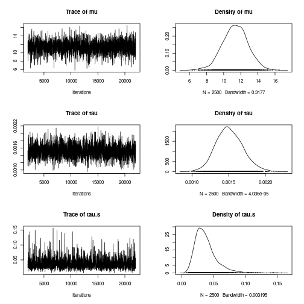

The slope is drawn from a distribution with mean around 11.5.


# Further reading

## On-line material

### Wikipedia

* [Bayesian statistics](https://en.wikipedia.org/wiki/Bayesian_statistics)
* [Bayesian hierarchical modelling](https://en.wikipedia.org/wiki/Bayesian_hierarchical_modeling)
* [MCMC](https://en.wikipedia.org/wiki/Markov_chain_Monte_Carlo)

### Software

* [JAGS](http://mcmc-jags.sourceforge.net/)
* [Stan](https://mc-stan.org/)
* [WinBUGS](https://www.mrc-bsu.cam.ac.uk/software/bugs/the-bugs-project-winbugs/)
* CRAN Task views
    - [Bayesian](https://cran.r-project.org/view=Bayesian)
* R packages
    - [rjags](https://cran.r-project.org/package=rjags)
	- [rstan](https://mc-stan.org/users/interfaces/rstan)
	- [brms](https://cran.r-project.org/package=brms)

## Books

* BDA3: Bayesian data analysis, third edition (Gelman et al) - [ISBN 1439840954](https://books.google.co.uk/books?isbn=1439840954)
* Statistical rethinking (McElreath) - [ISBN 1315362619](https://books.google.co.uk/books?isbn=1315362619)
* [Bayesian reasoning and machine learning](http://www.cs.ucl.ac.uk/staff/d.barber/brml/) (Barber) - [ISBN 0521518148](https://books.google.co.uk/books?isbn=0521518148) - **free PDF available**

