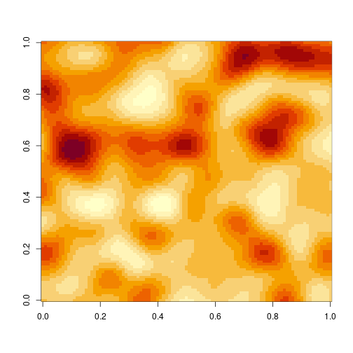
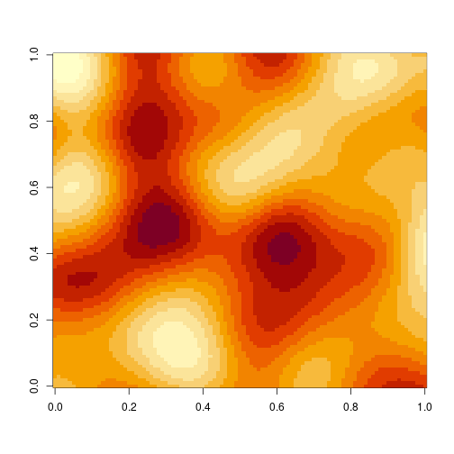
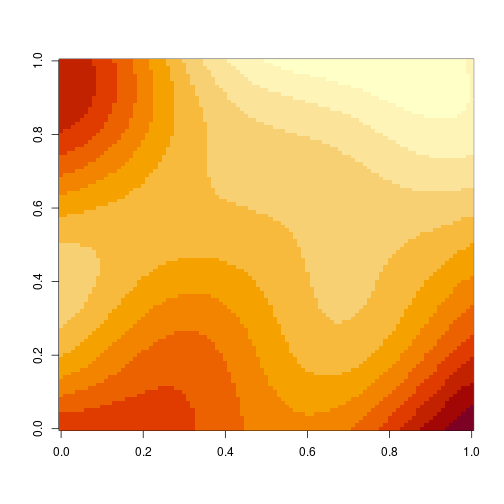

# Computer models

## Computer experiments

* Due to the expense of running complex codes, it is necessary to carefully *design experiments* for computer models, somewhat analogous to physical designed experiments
* Just as we perform real experiments to reduce our uncertainty about the behaviour of physical systems, we can perform experiments on computer models to reduce our uncertainty about their (pre-determined, but unknown) behaviour
* Computer models often have various *input parameters*, which we denote by $\mathbf{x}$, which alter the behaviour of the computer model
* Models will often generate lots of output. For this session, we will consider a *single output* of primary interest, $y$, which is a *deterministic* function of the inputs (even if there is some *stochasticity* internal to the computer model)

## Emulating a computer model

* An **emulator** is a *cheap* (fast) surrogate for the computer model, which has many potential uses
* Principally, it can be used instead of the real model in algorithms that require many evaluations of the simulator at many different input configurations
* Some emulators are good and some are bad --- to be useful, they should have a measure of *uncertainty* associated with them
* *Stochastic process* emulators define a probability distribution on the space of functions consistent with any known evaluations of the simulator
* *Gaussian processes* (GPs) are one of the simplest and most tractable stochastic processes on function space

# Gaussian processes (GPs)

## Gaussian processes

* A GP is a probability distribution on functions defined so that the marginal distribution of any finite number of points always has a multivariate normal (MVN) distribution
* Points close together in input space are typically more highly correlated than points far away
* Stationary GPs are defined by a *covariance function* - many different possible choices - here I've used a Gaussian kernel
$$
\operatorname{Cov}[f(\mathbf{x}),f(\mathbf{x}')] = K(\mathbf{x},\mathbf{x}') = \sigma^2\exp\left\{-\left(\frac{\Vert \mathbf{x}-\mathbf{x}'\Vert_2}{r}\right)^2\right\},
$$
containing two parameters: an asymptotic variance, $\sigma^2$, and a correlation length scale, $r$.
* A GP *conditioned* on observations is also a GP (*Kriging*)

## 1d GP

* 1d GPs are simplest to visualise and understand


```r
Grid = seq(0,1,0.002)
Dist = as.matrix(dist(Grid))
K = function(d, lengthScale=0.4, scale=10)
  (scale^2)*exp(-(d/lengthScale)^2)
rGP = function(r=0.4, s=10) {
  Var = K(Dist,r,s) + (1e-5)*diag(length(Grid))
  t(chol(Var)) %*% rnorm(length(Grid))
  }
set.seed(1)
```

## $r=0.01$


```r
plot(Grid,rGP(0.01),type="l",lwd=2,col="red")
```


## $r=0.05$


```r
plot(Grid,rGP(0.05),type="l",lwd=2,col="red")
```


## $r=0.1$


```r
plot(Grid,rGP(0.1),type="l",lwd=2,col="red")
```


## $r=0.5$


```r
plot(Grid,rGP(0.5),type="l",lwd=2,col="red")
```


## 2d GP

* 2d (and 3d) GPs can be useful for modelling smooth spatial heterogeneity


```r
Grid = seq(0,1,0.01)
xGrid = expand.grid(Grid,Grid)
Dist = as.matrix(dist(xGrid))
rGP2d = function(r=0.1, s=10) {
  Var = K(Dist,r,s) + (1e-5)*diag(length(Grid)^2)
  z = t(chol(Var)) %*% rnorm(length(Grid)^2)
  matrix(z,nrow=length(Grid))
  }
```

## $r=0.05$


```r
image(rGP2d(0.05))
```


## $r=0.1$


```r
image(rGP2d(0.1))
```



## $r=0.2$


```r
image(rGP2d(0.2))
```



## $r=0.5$


```r
image(rGP2d(0.5))
```




# Gaussian process emulation

## GP emulation of a computer code

* A GP defines a (tractable) probability distribution over (univariate) functions
* We can *condition* the GP on some observations and the conditional process is also a GP, but with a new mean and covariance function that is a function of the observations
* This new GP can represent our uncertainty about a function given some observations
* This uncertain representation of our knowledge of the function can be used to *emulate* an expensive function, such as a complex computer code
* The uncertainty associated with the GP can be used to properly quantify and propagage uncertainty associated with the fact that we don't actually know the expensive model everywhere


## DiceKriging

* `DiceKriging` is a popular R package with a range of functionality


```r
library(DiceKriging)
```

```
## Loading required package: methods
```

```r
set.seed(1)
nd = 20
x = as.matrix(runif(nd,0,5))
colnames(x)=c("x")
y = sin(x)+rnorm(nd,0,0.1)
```

---


```r
mod = km(~x,design=x,response=y,nugget=0.001)
```

```
## 
## optimisation start
## ------------------
## * estimation method   : MLE 
## * optimisation method : BFGS 
## * analytical gradient : used
## * trend model : ~x
## * covariance model : 
##   - type :  matern5_2 
##   - nugget : 0.001 
##   - parameters lower bounds :  1e-10 
##   - parameters upper bounds :  9.301198 
##   - variance bounds :  0.0101135 1.467872 
##   - best initial criterion value(s) :  -10.60975 
## 
## N = 2, M = 5 machine precision = 2.22045e-16
## At X0, 0 variables are exactly at the bounds
## At iterate     0  f=        10.61  |proj g|=       1.3755
## At iterate     1  f =       4.9129  |proj g|=       0.57078
## At iterate     2  f =       2.6956  |proj g|=       0.51071
## At iterate     3  f =       2.4316  |proj g|=       0.51061
## At iterate     4  f =        -1.28  |proj g|=       0.19052
## At iterate     5  f =      -1.2806  |proj g|=       0.35092
## At iterate     6  f =       -1.281  |proj g|=       0.38854
## At iterate     7  f =      -1.2813  |proj g|=     0.0023078
## At iterate     8  f =      -1.2813  |proj g|=    9.2668e-05
## At iterate     9  f =      -1.2813  |proj g|=     7.108e-09
## 
## iterations 9
## function evaluations 19
## segments explored during Cauchy searches 10
## BFGS updates skipped 0
## active bounds at final generalized Cauchy point 0
## norm of the final projected gradient 7.10801e-09
## final function value -1.28127
## 
## F = -1.28127
## final  value -1.281271 
## converged
```

---


```r
px = seq(0,6,0.01)
pred = predict(mod,px,type="SK")
```

```
## Warning in checkNames(X1 = X, X2 = newdata, X1.name = "the design", X2.name
## = "newdata"): newdata not named: newdata's variables are inherited from the
## design
```

---


```r
plot(px,pred$mean,type="l",ylim=c(-2,2),main="DiceKriging")
polygon(c(px,rev(px)),c(pred$upper,rev(pred$lower)),col="lightgrey",border=NA)
lines(px,pred$mean,type="l")
points(x,y,pch=19,col=2)
```


## mlegp

* `mlegp` is an alternative package, based on the book by Santner et al.


```r
library(mlegp)
mod = mlegp(x,y,constantMean=0,nugget.known=1,nugget=0.001)
```

```
## no reps detected in meanPerReps, returning originals...
## 
## ========== FITTING GP # 1 ==============================
## running simplex # 1...
## ...done
## ...simplex #1 complete, loglike = 0.895601 (convergence)
## running simplex # 2...
## ...done
## ...simplex #2 complete, loglike = 0.895601 (convergence)
## running simplex # 3...
## ...done
## ...simplex #3 complete, loglike = 0.895601 (convergence)
## running simplex # 4...
## ...done
## ...simplex #4 complete, loglike = 0.895601 (convergence)
## running simplex # 5...
## ...done
## ...simplex #5 complete, loglike = 0.895601 (convergence)
## 
## using L-BFGS method from simplex #2...
## 	iteration: 1,loglike = 0.895601
## ...L-BFGS method complete
## 
## Maximum likelihood estimates found, log like =  0.895601
## creating gp object......done
```

---


```r
pred = predict(mod,as.matrix(px),se.fit=TRUE)
pred$upper = pred$fit + 2*pred$se.fit
pred$lower = pred$fit - 2*pred$se.fit
```

---


```r
plot(px,pred$fit,type="l",ylim=c(-2,2),main="mlegp")
polygon(c(px,rev(px)),c(pred$upper,rev(pred$lower)),col="lightgrey",border=NA)
lines(px,pred$fit,type="l")
points(x,y,pch=19,col=2)
```


## GPfit

* `GPfit` is another R package, which has more sophisticated parameter estimation procedures than some other packages


```r
library(GPfit)
xScaled = x/5
mod = GP_fit(xScaled,y)
```

---


```r
pxScaled = px/5
pred = predict(mod,as.matrix(pxScaled))
pred$upper = pred$Y_hat + 2*pred$MSE
pred$lower = pred$Y_hat - 2*pred$MSE
```

---


```r
plot(px,pred$Y_hat,type="l",ylim=c(-2,2),main="GPfit")
polygon(c(px,rev(px)),c(pred$upper,rev(pred$lower)),col="lightgrey",border=NA)
lines(px,pred$Y_hat,type="l")
points(x,y,pch=19,col=2)
```


## hetGP

* `hetGP` is a modern, sophisticated package for GP emulation, including good support for large datasets, stochastic kriging for noisy models with replication, and heteroskedastic GP modelling


```r
library(hetGP)
mod = mleHomGP(x,y) # homoskedastic GP fit
pred = predict(mod,as.matrix(px))
pred$var = pred$sd2 + pred$nugs
pred$sd = sqrt(pred$var)
pred$upper = pred$mean + 2*pred$sd
pred$lower = pred$mean - 2*pred$sd
```

---


```r
plot(px,pred$mean,type="l",ylim=c(-2,2),main="hetGP (mleHomGP)")
polygon(c(px,rev(px)),c(pred$upper,rev(pred$lower)),col="lightgrey",border=NA)
lines(px,pred$mean,type="l")
points(x,y,pch=19,col=2)
```


## Heteroskedasticity and the Motorcycle data

* The `mcycle` dataset from the `MASS` package is output from a computer model exhibiting heteroskedasticity - non-stationary variance
* We will start with a homoskedastic fit


```r
library(MASS)
mod = mleHomGP(mcycle$time,mcycle$accel) # homoskedastic
px=seq(0,60,0.1)
pred = predict(mod,as.matrix(px))
pred$var = pred$sd2 + pred$nugs
pred$sd = sqrt(pred$var)
pred$upper = pred$mean + 2*pred$sd
pred$lower = pred$mean - 2*pred$sd
```

---


```r
plot(px,pred$mean,ylim=c(-150,100),type="l",main="hetGP (mleHomGP)")
polygon(c(px,rev(px)),c(pred$upper,rev(pred$lower)),col="lightgrey",border=NA)
lines(px,pred$mean,type="l")
points(mcycle,pch=19,col=2)
```


---

* Next we will do a heteroskedastic fit


```r
mod = mleHetGP(mcycle$time,mcycle$accel) # heteroskedastic
pred = predict(mod,as.matrix(px))
pred$var = pred$sd2 + pred$nugs
pred$sd = sqrt(pred$var)
pred$upper = pred$mean + 2*pred$sd
pred$lower = pred$mean - 2*pred$sd
```

---


```r
plot(px,pred$mean,ylim=c(-150,100),type="l",main="hetGP (mleHetGP)")
polygon(c(px,rev(px)),c(pred$upper,rev(pred$lower)),col="lightgrey",border=NA)
lines(px,pred$mean,type="l")
points(mcycle,pch=19,col=2)
```


# Design of computer experiments

## Latin hypercube sampling

* When working with expensive computer models with input parameters, the choice of which combination of inputs to run is important, and worth doing carefully
* For a single tunable parameter, a uniform grid can be sensible
* For multiple input parameters, a cartesian product design seems intuitive, but is actually a very poor choice, and gets worse in higher dimensions
* LHS is a technique for choosing points such that the univariate margins essentially form a uniform grid
* The simplest approaches give random designs subject to the constraint of uniform margins
* More sophisticated variants try to optimise some desirable property of the design, such as maximising the minimum distance between points

## The `lhs` R package


```r
library(lhs)
set.seed(1)
```


```r
help(package="lhs")
?randomLHS
?maximinLHS
vignette(package="lhs")
vignette("lhs_basics")
```

## A 2d example


```r
x = maximinLHS(50,2)
plot(x, pch=19, col=2)
```


## Univariate margins are uniform


```r
op = par(mfrow=c(1,2))
hist(x[,1]); hist(x[,2])
```


```r
par(op)
```

## Augmenting a design


```r
y = augmentLHS(x,20)
plot(y,pch=19,col=3); points(x,pch=19,col=2)
```


# Further reading

## Software

### R

* CRAN Task Views
    - [Spatial](https://cran.r-project.org/view=Spatial)
    - [Spatio-Temporal](https://cran.r-project.org/view=SpatioTemporal)
* R Packages
    - [hetGP](https://cran.r-project.org/package=hetGP) (heteroskedastic GPs)
    - [DiceKriging](https://cran.r-project.org/package=DiceKriging)
    - [GPfit](https://cran.r-project.org/package=GPfit) (robust fitting)
    - [mlegp](https://cran.r-project.org/package=mlegp) (multiple outputs)
    - [lhs](https://cran.r-project.org/package=lhs) (latin hypercube sampling)

### Python

* [GPy](https://sheffieldml.github.io/GPy/)

## Books and on-line articles

### Wikipedia

* [Computer experiment](https://en.wikipedia.org/wiki/Computer_experiment)
* [Gaussian process](https://en.wikipedia.org/wiki/Gaussian_process)
* [Latin hypercube sampling](https://en.wikipedia.org/wiki/Latin_hypercube_sampling)
* [Uncertainty quantification](https://en.wikipedia.org/wiki/Uncertainty_quantification)


### Books

* The Design and Analysis of Computer Experiments (Santner et al.) - [ISBN 1493988476](https://books.google.co.uk/books?isbn=1493988476)
* Gaussian processes for machine learning (Rasmussen and Williams) - [ISBN 026218253X](https://books.google.co.uk/books?isbn=026218253X)

