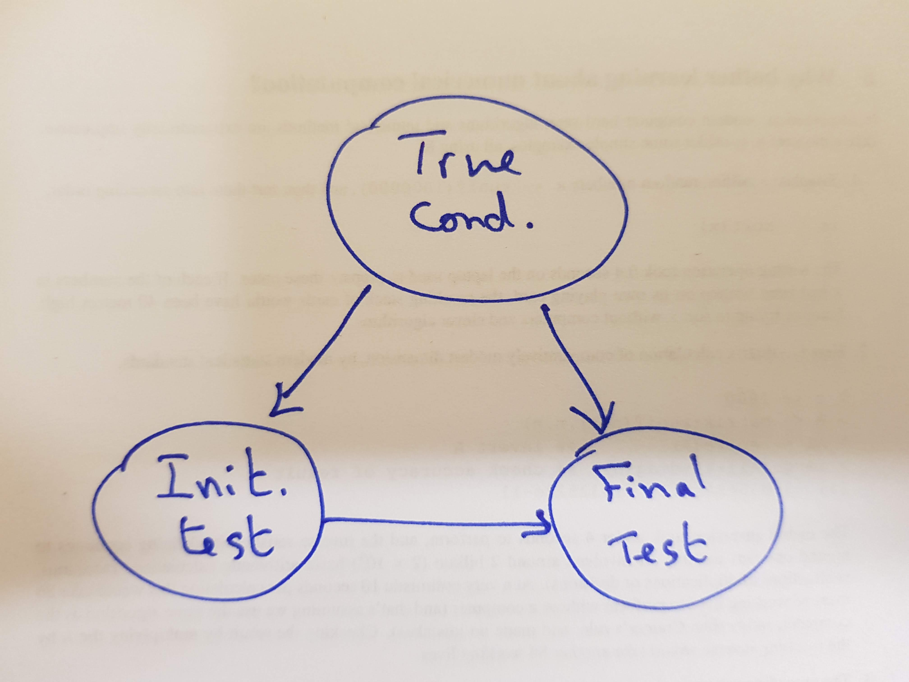
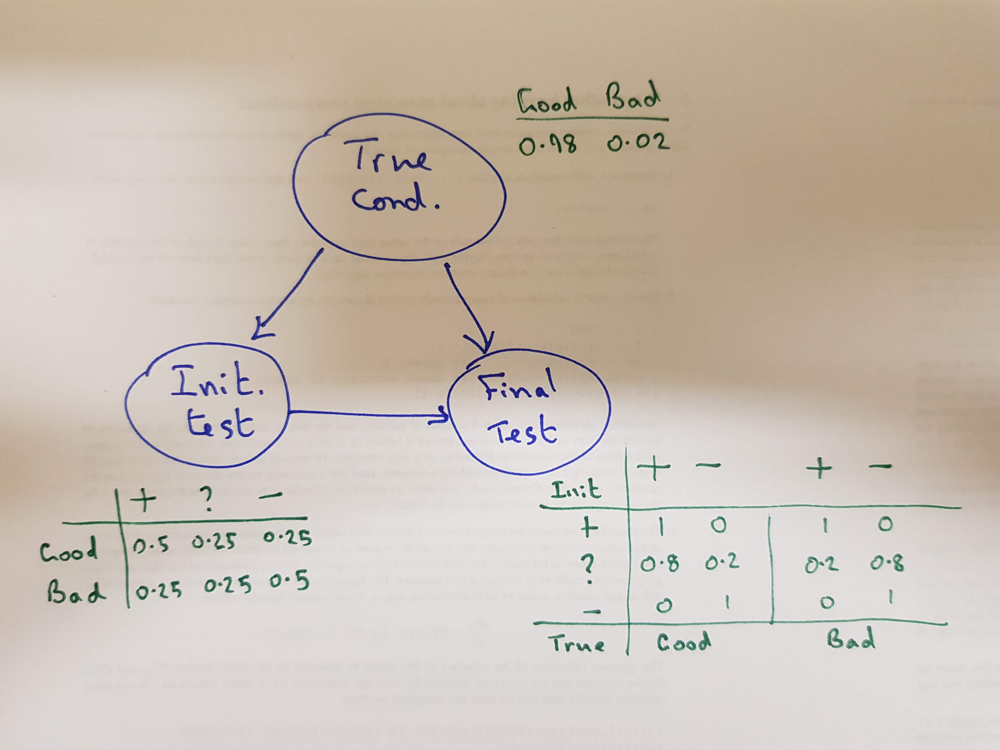
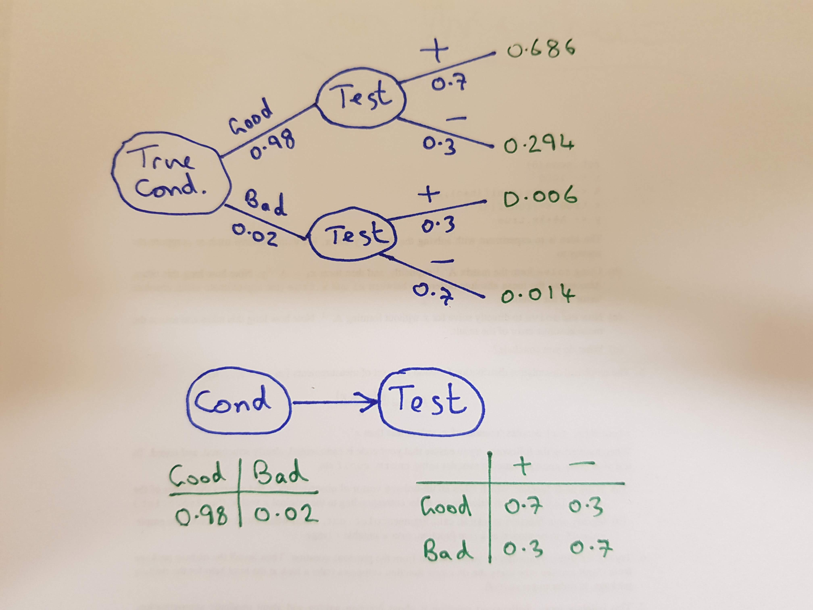
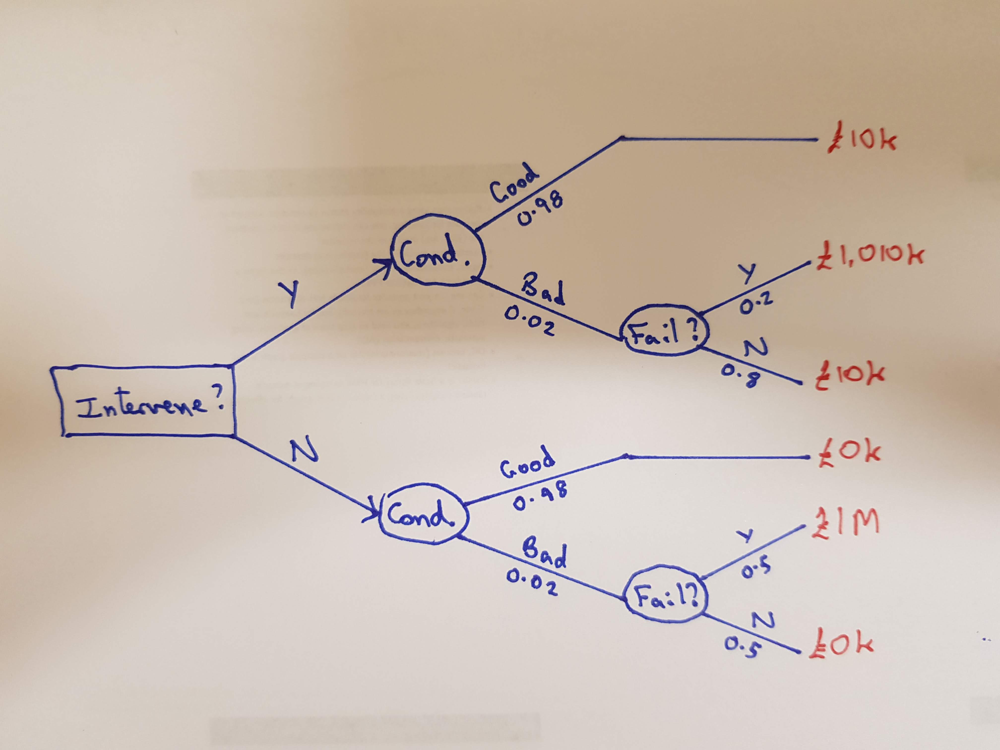
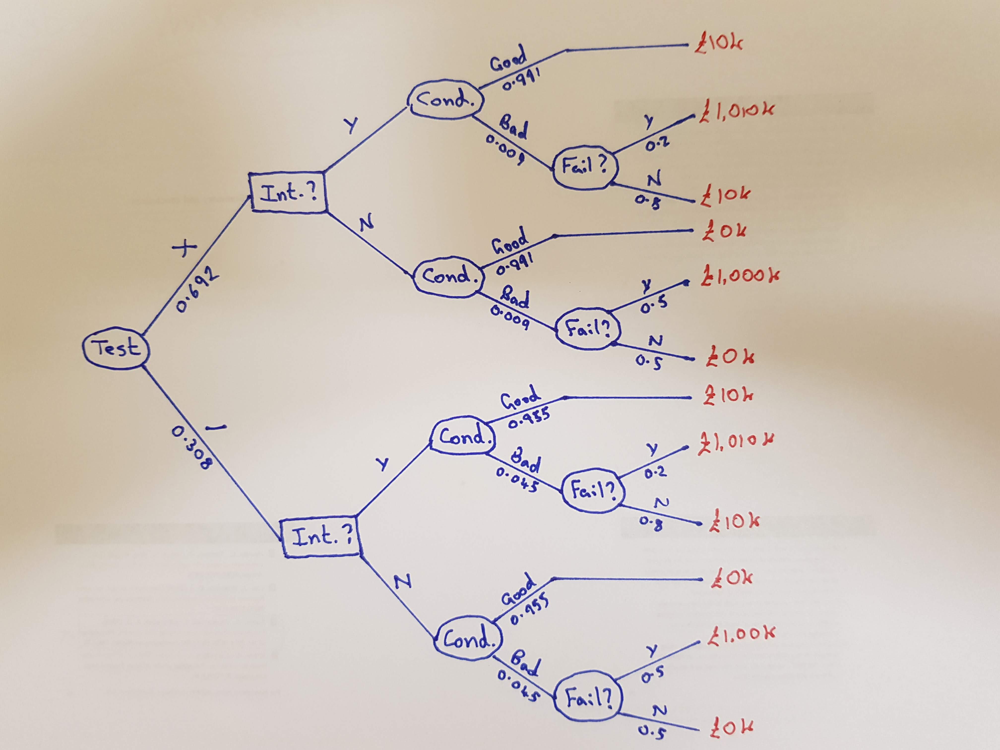

# Some elementary probability

## Events and probabilities

An event, $E$, may turn out to be true or false. We write $P(E)$ for the probability that $E$ will turn out to be true. $\bar E$ is the event that $E$ is false. We require $P(E)+P(\bar E)=1$.

For events $E$ and $F$ we write $E \cap F$ for the event that both $E$ and $F$ are true, and $E \cup F$ for the event that at least one of $E$ and $F$ is true.

If $E$ and $F$ are *disjoint* (cannot both be true), we have that $P(E \cap F)=0$ and $P(E \cup F) = P(E) + P(F)$.

In general, we have
$$P(E \cup F) = P(E) + P(F) - P(E\cap F).$$

## Conditional probability and independence

We denote the *conditional* probability of $E$ *given* $F$ (the probability that $E$ is true taking into account the fact that we know $F$ is true) by $P(E|F)$, and define it as
$$ P(E | F) = \frac{P(E\cap F)}{P(F)}, $$
assuming $P(F)>0$.

We say that events $E$ and $F$ are *independent* if
$$P(E\cap F) = P(E)P(F).$$
Note then that $P(E|F) = P(E)$ (assuming $P(F)>0$) and by symmetry $P(F|E) = P(F)$ (assuming $P(E)>0$). That is, learning the outcome of one event does not change the probability of the other.

## Bayes theorem

Re-arranging the definition of conditional probability, we see that the joint probability of $E$ and $F$ can be written $P(E\cap F) = P(F)P(E|F)$, and by symmetry, we could also write $P(E\cap F) = P(E)P(F|E)$, and these are two different ways of *factorising* the joint probability. Equating these gives
$$P(E)P(F|E) = P(F)P(E|F)$$
$$\Rightarrow P(F|E) = \frac{P(F)P(E|F)}{P(E)},$$
and this is the simplest example of **Bayes theorem**, which is typically concerned with reversing conditioning.


## Total probability

For any $E$ and $F$ we can write $E$ as the disjoint union $E = (E\cap F) \cup (E\cap \bar F)$ giving
$$ P(E) = P(E\cap F) + P(E \cap \bar F)$$
which we can re-write as
$$ P(E) = P(E|F)P(F) + P(E|\bar F)P(\bar F).$$
This is sometimes known as the *theorem of total probability*.
We can use this to expand the denominator of *Bayes theorem* as
$$ P(F|E) = \frac{P(F)P(E|F)}{P(E|F)P(F) + P(E|\bar F)P(\bar F)}. $$

# Probability tree diagrams

## Rapid assessment of slope condition

Suppose we have a two-stage rapid assessment test for a slope. A quick initial test will return + (the slope appears to be in good condition), - (the slope appears to be in bad condition) or ? (the test is inconclusive). In the case of an inconclusive initial test, a second test is carried out, and this test will return either + or -.

When the slope is actually in good condition, the initial test will return +, ?, - with probabilities 0.5, 0.25, 0.25. If the second test is carried out, it will return + with probability 0.8 and - with probability 0.2.

When the slope is actually in poor condition, the initial test will return +, ?, - with probabilities 0.25, 0.25, 0.5. If the second test is carried out, it will return + with probability 0.2 and - with probability 0.8.

Let's assume that 98% of slopes are good: $P(\text{Good}) = 0.98$.

## Probability tree


## Computing on a probability tree

Typically, we multiply probabilities along branches to get the joint probability of multiple related outcomes.

Given probabilities for the disjoint events at the leaves of the tree, we can then sum these to get probabilities of outcomes of interest.


## Bayesian network




## DAG model with conditional probability tables (CPTs)



## Bayesian networks

Conceptually, a Bayesian network/DAG model represents the uncertain variables in a problem and how they influence one another. Nodes without parents have a vector of probabilities of outcomes. Nodes with parents have a table of conditional probabilities of outcomes conditional on the outcome of any parents.

The DAG structure together with the specification of CPTs in principle allow the construction of a full probability tree of all possible outcomes, and hence the computation of any required probabilities of interest.

In practice there are efficient algorithms for computing probabilities associated with Bayesian networks which do not require a full expansion of the graph.

## DAGs as a factorisation

The DAG represents a *factorisation* of the joint probability distribution over all variables, and is not unique in general. Here, for example, we have
$$P(\text{Cond}, \text{Init}, \text{Final}) = P(\text{Cond})P(\text{Init}|\text{Cond})P(\text{Final}|\text{Init}, \text{Cond}).$$
Not all factorisations are equivalent, but the one above is completely general in the sense that any joint distribution over the three variables could be factorised in this way.

In general, for a DAG with nodes $v_i$ having parents $\operatorname{pa}\{v_i\}$ we have
$$P(\mathbf{v}) = \prod_{i=1}^n P(v_i|\operatorname{pa}\{v_i\}).$$

## Node elimination

Ultimately the test procedure returns either + or -, and we are not particularly interested in the intermediate stage, so we can *marginalise* out the intermediate stage. eg.
$$P(+|\text{Good}) = 0.5 + 0.25\times 0.8 = 0.7,$$
etc., leading to CPT:

| Outcome | + | - |
|--------:|:-:|:-:|
| Good    |0.7|0.3|
| Bad     |0.3|0.7|

This leads to a simplified probability tree and Bayesian network.

---



## Reversing an arc

We know $P(\text{Test}|\text{Cond})$, but we are probably more interested in $P(\text{Cond}|\text{Test})$. So we need to turn our conditional probabilities around using *Bayes theorem*. eg.
$$ P(\text{Bad} | \text{+} ) = \frac{P(\text{Bad})P(+|\text{Bad})}{P(+)} = \frac{0.02\times 0.3}{0.692} = 0.0087. $$

Repeating this for the other conditional probabilities allows us to reverse the order of nodes in the probability tree and reverse the arc in the DAG model.

This reversal of conditioning allows us to update our prior belief about the condition of a slope based on the result of the rapid characterisation test.

---


# DAG models in R

## Installing gRain

There is a nice R package for working with discrete graphical models in R, called `gRain`. Unfortunately it is less easy to install than most R packages on [CRAN](https://cran.r-project.org/), since it has dependencies on some packages that are not in CRAN, but instead in another R package repository known as [Bioconductor](https://bioconductor.org/). So installing `gRain` in a recent version of R should proceed roughly as follows:

```{r eval=FALSE}
install.packages("BiocManager")
BiocManager::install()
BiocManager::install(c("graph", "RBGL", "Rgraphviz"))
install.packages("gRain")
```

```{r message=FALSE}
library(gRain)
```

```{r eval=FALSE}
vignette("gRain-intro")
```

## Condition assessment example

```{r}
tc = cptable(~cond, values=c(98,2),levels=c("Good","Bad"))
it = cptable(~init|cond, values=c(50,25,25,25,25,50),
      levels=c("+","?","-"))
ft = cptable(~final|init:cond, 
      values=c(10,0,8,2,0,10,10,0,2,8,0,10), 
	  levels=c("+","-"))
plist = compileCPT(list(tc,it,ft))
plist
```

---

```{r}
plist$final
```

---

```{r}
net = grain(plist)
net
```

---

```{r grain-plot}
plot(net)
```

---

```{r}
querygrain(net, nodes=c("final"), type="marginal")

netP = setEvidence(net, evidence=list(final="+"))
querygrain(netP, nodes=c("cond"), type="marginal")
```

# Decision trees and influence diagrams

## Costs, expected costs and decisions

We can often associate *costs* or *rewards* with the outcomes at the leaves of probability trees. We can then use the trees to compute *expected* costs (or rewards). If there are *decisions* that can be made, we may include the decision as (square) nodes in our probability trees, and these then become known as [*decision trees*](https://en.wikipedia.org/wiki/Decision_tree).

If we include decision nodes in Bayesian networks, they are usually referred to as [*influence diagrams*](https://en.wikipedia.org/wiki/Influence_diagram) (or *decision networks*).

## Terminology clash

Unfortunately the term *decision tree* now has two common meanings. Traditionally, it referred to probability trees including decision nodes, as just described above. However, there is now a second meaning of the term that is often used in machine learning, and increasingly often in statistics, where it refers to a particular kind of flexible model for regression and classification. This type of [*decision tree*](https://en.wikipedia.org/wiki/Decision_tree_learning) underpins ML methods such as CART, BART and [*random forests*](https://en.wikipedia.org/wiki/Random_forest). 

## Outcomes, cost, and expected cost

Suppose (for simplicity) that a slope in good condition will not fail (over the next decade) and the a slope in bad condition will fail with probability 0.5. Suppose also that failure will incur a cost of £1M. We can use a simple probability tree to understand expected cost.

{ width=50% }

## Intervention decision

Suppose now that we have the option of intervening (eg. installing a drain), at the cost of £10K. Intervening on a good slope will have no impact, but intervening on a bad slope will reduce the probability of failure from 0.5 to 0.2. Should we intervene?

{ width=50% }

---



---


Global intervention is not cost effective in this example.

## Testing to gain information

What about the rapid characterisation test discussed earlier? If we can carry out that test and use the result of the test to inform our intervention decision, perhaps that will lead to lower costs overall.

{ width=50% }

---



---


## Value of information

Unsurprisingly, if the test suggests that the slope is in good condition, then it is not worth intervening. However, if the test suggests that the slope is in poor condition, then we see that it is cost effective to intervene, since the cost of intervention is less than the expected cost associated with failure.

Overall, the expected cost associated with the optimal decision strategy prior to conducting the test is £8.97K. This is roughly £1K less than the £10K cost associated with the optimal decision in the absence of test information. So, the information we get from the test has a quantifiable value of around £1K. That is, it would be worth paying up to £1K to have this test carried out.


## Scaling up


From Baecher and Christian

---


From Baecher and Christian

# Further reading

## On-line material

### Wikipedia

* [Graphical model](https://en.wikipedia.org/wiki/Graphical_model)
* [Bayesian network](https://en.wikipedia.org/wiki/Bayesian_network)
* [Decision tree](https://en.wikipedia.org/wiki/Decision_tree)
* [Influence diagram](https://en.wikipedia.org/wiki/Influence_diagram)

### R software

* [CRAN Graphical models task view](https://cran.r-project.org/web/views/gR.html)
    + [R gRain package](https://cran.r-project.org/web/packages/gRain/index.html) 
    	- [vignette](https://cran.r-project.org/web/packages/gRain/vignettes/gRain-intro.pdf)
        - [overview and installation instructions](http://people.math.aau.dk/~sorenh/software/gR/)
* [HydeNet](https://cran.r-project.org/package=HydeNet)
  
## Books

* Reliability and Statistics in Geotechnical Engineering (Baecher and Christian) - [ISBN 0470871253](https://books.google.co.uk/books?isbn=0470871253)
* [Bayesian reasoning and machine learning](http://www.cs.ucl.ac.uk/staff/d.barber/brml/) (Barber) - [ISBN 0521518148](https://books.google.co.uk/books?isbn=0521518148) - **free PDF available**
* Graphical models with R (Højsgaard et al) -  [ISBN 1461422981](https://books.google.co.uk/books?isbn=1461422981)
* Making hard decisions (Clemen) - [ISBN 0534260349](https://books.google.co.uk/books?isbn=0534260349)
* Probabilistic reasoning in intelligent systems (Pearl) - [ISBN 0080514898](https://books.google.co.uk/books?isbn=0080514898)
* Probabilistic networks and expert systems (Cowell et al) - [ISBN 0387718230](https://books.google.co.uk/books?isbn=0387718230)

